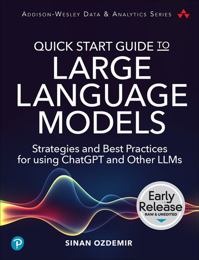

<h1 align="center">Quick Start Guide to Large Language Models</h1>

  <a href="https://amazon.com/quick-start-guide-language-models/dp/0138199191">Get your copy today</a> and please leave a rating/review to tell me what you thought! ⭐⭐⭐⭐⭐

  

  Welcome to the GitHub repository for the "Quick Start Guide to Large Language Models" book. This repository contains the code snippets and notebooks used in the book, demonstrating various applications of Transformer models.

## Repository Structure

### Directories

* `notebooks`: This directory contains Jupyter notebooks for each chapter in the book.
* `data`: Contains the datasets used in the notebooks.
* `images`: Contains images and graphs used in the notebooks.

### Notebooks

Here are some of the notebooks included in the `notebooks` directory:

#### Part I - Introduction to Large Language Models

* [`2_semantic_search.ipynb`](notebooks/2_semantic_search.ipynb): An introduction to semantic search using OpenAI and open source models.
  * I have an updated version [here](https://colab.research.google.com/drive/1h8dmDclOnYsXKlMDYp1uRuW55xbzypUY?usp=sharing) with the updated OpenAI client usage **plus** the use of the latest V3 OpenAI Embedding. Spoiler alert, the open-source embedder + a fine-tuned cross encoder beat even the largest OpenAI embedder :)
* [`3_prompt_engineering.ipynb`](notebooks/3_prompt_engineering.ipynb): A guide to effective prompt engineering for instruction aligned LLMs.

#### Part II - Getting the Most Out of LLMs

* [`4_fine_tuned_classification.ipynb`](notebooks/4_fine_tuned_classification.ipynb): Learn how to perform text classification through fine-tuning OpenAI models
  * Check out [`UPDATED 4_fine_tuned_classification_sentiment.ipynb`](notebooks/UPDATED%204_fine_tuned_classification_sentiment.ipynb) for the updated version of the previous notebook because OpenAI made a new Fine-tuning API and Amazon revoked access to the dataset I used (always keeping me on my toes, thanks everyone)
* [`5_adv_prompt_engineering.ipynb`](notebooks/5_adv_prompt_engineering.ipynb): Advanced techniques for prompt engineering including k-shot, semantic k-shot, chain of thought prompting, chaining, and building a retrieval augmented generating (RAG) enabled chatbot with GPT-4.
* [`5_VQA.ipynb`](notebooks/5_VQA.ipynb): Introduction to prompt chaining and Visual Question Answering (VQA) with open source LLMs
* [`6_recommendation_engine.ipynb`](notebooks/6_recommendation_engine.ipynb): Building a recommendation engine using custom fine-tuned LLMs
  * Check out this colab notebook here for the most recent update of this case study with more graphs and more compute! [https://colab.research.google.com/drive/1JfxyxdGCDjYeO52Bk1JzW4Af94xndTws?usp=sharing](https://colab.research.google.com/drive/1JfxyxdGCDjYeO52Bk1JzW4Af94xndTws?usp=sharing)

#### Part III - Advanced LLM Usage

* [`7_constructing_a_vqa_system.ipynb`](notebooks/7_constructing_a_vqa_system.ipynb): Step-by-step guide to constructing a Visual Question Answering system using open-source GPT2 and the Vision Transformer.
* [`7_using_our_vqa.ipynb`](notebooks/7_using_our_vqa.ipynb): A notebook to use the VQA system we built in the previous notebook.
* [`7_rl_flan_t5_summaries.ipynb`](notebooks/7_rl_flan_t5_summaries.ipynb): Using Reinforcement Learning (RL) to produce more neutral and grammatically correct summaries with the FLAN-T5 model.
* [`8_latex_gpt2.ipynb`](notebooks/8_latex_gpt2.ipynb): Fine-tuning GPT-2 to generate LaTeX formulas
* [`8_anime_category_classification_model_freezing.ipynb`](notebooks/8_anime_category_classification_model_freezing.ipynb): Fine-tuning a BERT model to classify anime categories with a comparison between freezing model layers and keeping the model unfrozen.
* [`8_optimizing_fine_tuning.ipynb`](notebooks/8_optimizing_fine_tuning.ipynb): Best practices for optimizing fine-tuning of transformer models - dynamic padding, gradient accumulation, mixed precision, and more.
* [`8_sawyer_1_instruction_ft.ipynb`](notebooks/8_sawyer_1_instruction_ft.ipynb): Fine-tuning the instruction model for the SAWYER bot.
* [`8_sawyer_2_train_reward_model.ipynb`](notebooks/8_sawyer_2_train_reward_model.ipynb): Training a reward model for the SAWYER bot from human preferences.
* [`8_sawyer_3_rl.ipynb`](notebooks/8_sawyer_3_rl.ipynb): Using Reinforcement Learning from Human Feedback (RLHF) to further align the SAWYER bot
* [`8_sawyer_4_use_sawyer.ipynb`](notebooks/8_sawyer_4_use_sawyer.ipynb): Using our SAWYER bot
* [`9_distillation.ipynb`](notebooks/9_distillation.ipynb): An exploration of knowledge distillation techniques for transformer models.

We will continue to add more notebooks exploring topics like fine-tuning, advanced prompt engineering, combining transformers, and various use-cases. Stay tuned!

## How to Use

To use this repository, clone it to your local machine, navigate to the notebooks directory, and open the Jupyter notebook of your choice. Note that some notebooks may require specific datasets, which can be found in the `data` directory.

Please ensure that you have the necessary libraries installed and that they are up to date. This can usually be done by running `pip install -r requirements.txt` in the terminal.

## Contributing

Contributions are welcome! Feel free to submit a pull request if you have any additions, corrections, or enhancements to submit.

## Disclaimer

This repository is for educational purposes and is meant to accompany the "Quick Start Guide to Large Language Models" book. Please refer to the book for in-depth explanations and discussions of the topics covered in the notebooks.

## More From Sinan

1. Check out Sinan's Newsletter [AI Office Hours](https://ai-office-hours.beehiiv.com/) for more AI/LLM content!
2. Sinan has a podcast called [Practically Intelligent](https://podcasts.apple.com/us/podcast/practically-intelligent/id1678774315) where he chats about the latest and greatest in AI!
3. Follow the [Getting Started with Data, LLMs and ChatGPT Playlist on O'Reilly](https://www.oreilly.com/playlists/2953f6c7-0e13-49ac-88e2-b951e11388de) for a curated list of Sinan's work!
