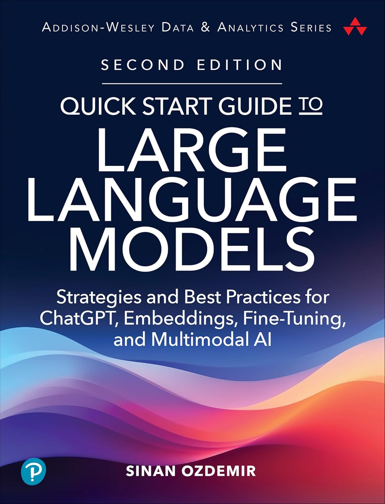

# Quick Start Guide to Large Language Models - Second Edition
<p align="center">
  <a href="https://www.amazon.com/Quick-Start-Guide-Language-Models-dp-0135346568/dp/0135346568">Get your copy today</a> and please leave a rating/review to tell me what you thought! ⭐⭐⭐⭐⭐
</p>

<p align="center" href="https://www.amazon.com/Quick-Start-Guide-Language-Models-dp-0135346568/dp/0135346568">
  
</p>


Welcome to the GitHub repository for the **"Quick Start Guide to Large Language Models - Second Edition"**. This repository contains the code snippets and notebooks used in the book, demonstrating various applications and advanced techniques in working with Transformer models and large language models (LLMs). [View the code for the First Edition here](https://github.com/sinanuozdemir/quick-start-guide-to-llms/tree/1e)


## Repository Structure

### Directories

- `notebooks`: Contains Jupyter notebooks for each chapter in the book.
- `data`: Contains the datasets used in the notebooks.
- `images`: Contains images and graphs used in the notebooks.

### Notebooks

Below is a list of the notebooks included in the `notebooks` directory, organized by the chapters in the book.

#### Part I - Introduction to Large Language Models

- **Chapter 2: Semantic Search with LLMs**
  - [`02_semantic_search.ipynb`](notebooks/02_semantic_search.ipynb): An introduction to semantic search using OpenAI and open-source models.

- **Chapter 3: First Steps with Prompt Engineering**
  - [`03_prompt_engineering.ipynb`](notebooks/03_prompt_engineering.ipynb): A guide to effective prompt engineering for instruction-aligned LLMs.

- **Chapter 4: The AI Ecosystem: Putting the Pieces Together**
  - [`04_rag_retrieval.ipynb`](notebooks/04_rag_retrieval.ipynb): Building a Retrieval-Augmented Generation (RAG) pipeline.
  - [`04_agent.ipynb`](notebooks/04_agent.ipynb): Constructing an AI agent using LLMs and other tools.

#### Part II - Getting the Most Out of LLMs

- **Chapter 5: Optimizing LLMs with Customized Fine-Tuning**
  - [`05_bert_app_review.ipynb`](notebooks/05_bert_app_review.ipynb): Fine-tuning a BERT model for app review classification.
  - [`05_openai_app_review_fine_tuning.ipynb`](notebooks/05_openai_app_review_fine_tuning.ipynb): Fine-tuning OpenAI models for app review classification.

- **Chapter 6: Advanced Prompt Engineering**
  - [`06_adv_prompt_engineering.ipynb`](notebooks/06_adv_prompt_engineering.ipynb): Advanced techniques in prompt engineering, including output validation and semantic few-shot learning.


  - [`06_adv_prompt_engineering - DEEPSEEK.ipynb`](notebooks/06_adv_prompt_engineering%20-%20DEEPSEEK.ipynb): Extending the MathQA case study to Deepseek V3 and R1. Prompting still seems to matter :) 

  - [`06_adv_prompt_engineering - Llama 4.ipynb`](notebooks/06_adv_prompt_engineering%20-%20Llama4.ipynb): Extending the MathQA case study to Llama 4 Scout. Interesting the prompt responds well to CoT but not as much to Few-shot prompting on this benchmark.

- **Chapter 7: Customizing Embeddings and Model Architectures**
  - [`07_recommendation_engine.ipynb`](notebooks/07_recommendation_engine.ipynb): Building a recommendation engine using custom fine-tuned LLMs and embeddings.

#### Part III - Advanced LLM Usage

- **Chapter 9: Moving Beyond Foundation Models**
  - [`09_constructing_a_vqa_system.ipynb`](notebooks/09_constructing_a_vqa_system.ipynb): Step-by-step guide to constructing a Visual Question Answering (VQA) system using GPT-2 and Vision Transformer.
  - [`09_using_our_vqa.ipynb`](notebooks/09_using_our_vqa.ipynb): Using the VQA system built in the previous notebook.
  - [`09_flan_t5_rl.ipynb`](notebooks/09_flan_t5_rl.ipynb): Using Reinforcement Learning (RL) to improve FLAN-T5 model outputs.

- **Chapter 10: Advanced Open-Source LLM Fine-Tuning**
  - [`10_SAWYER_LLAMA_SFT.ipynb`](notebooks/10_SAWYER_LLAMA_SFT.ipynb): Fine-tuning the Llama-3 model to create the SAWYER bot.
  - [`10_SAWYER_Reward_Model.ipynb`](notebooks/10_SAWYER_Reward_Model.ipynb): Training a reward model from human preferences for the SAWYER bot.
  - [`10_SAWYER_RLF.ipynb`](notebooks/10_SAWYER_RLF.ipynb): Applying Reinforcement Learning from Human Feedback (RLHF) to align the SAWYER bot.
  - [`10_SAWYER_USE_SAWYER.ipynb`](notebooks/10_SAWYER_USE_SAWYER.ipynb): Using the SAWYER bot.
  - [`10_anime_category_classification_model_freezing.ipynb`](notebooks/10_anime_category_classification_model_freezing.ipynb): Fine-tuning a BERT model for anime category classification, comparing layer freezing techniques.
  - [`10_latex_gpt2.ipynb`](notebooks/10_latex_gpt2.ipynb): Fine-tuning GPT-2 to generate LaTeX formulas.
  - [`10_optimizing_fine_tuning.ipynb`](notebooks/10_optimizing_fine_tuning.ipynb): Best practices for optimizing fine-tuning of transformer models.

- **Chapter 11: Moving LLMs into Production**
  - [`11_distillation_example_1.ipynb`](notebooks/11_distillation_example_1.ipynb): Exploring knowledge distillation techniques for transformer models.
  - [`11_distillation_example_2.ipynb`](notebooks/11_distillation_example_2.ipynb): Advanced distillation methods and applications.
  - [`11_llama_quantization.ipynb`](notebooks/11_llama_quantization.ipynb): Quantizing Llama models for efficient deployment.

- **Chapter 12: Evaluating LLMs**
  - [`12_llm_calibration.ipynb`](notebooks/12_llm_calibration.ipynb): Techniques for calibrating LLM outputs.
  - [`12_llm_gen_eval.ipynb`](notebooks/12_llm_gen_eval.ipynb): Methods for evaluating the generative capabilities of LLMs.
  - [`12_cluster.ipynb`](notebooks/12_cluster.ipynb): Clustering techniques for analyzing LLM outputs.
  - Probing - There are over a dozen notebooks for Probing so I will only share a few key ones here:
	  - [Llama-3 8B Instruct with prompt "Who is {NAME}"](https://colab.research.google.com/drive/1e1d9fATVjVun-_tPj4vS_DSTGaIfxs01?usp=sharing)
	  - [BERT-large-cased no prompt](https://colab.research.google.com/drive/1cizgoh1J6Y-DHBrOkNTFo9Y1CypjwuQM?usp=sharing)
	  - [Mistral-7B-Instruct-v0.3 with prompt "Who is {NAME}"](https://colab.research.google.com/drive/1VL3betxqVZ_H3_8XmLbjE0hEjaoy-HPV?usp=sharing)

## How to Use

To use this repository:

1. **Clone the repository to your local machine:**

```bash
gh repo clone sinanuozdemir/quick-start-guide-to-llms
```

2. **Navigate to the notebooks directory and open the Jupyter notebook of your choice:**

```bash
cd quick-start-llms
```

3. **Install the necessary libraries:**
The traditional `pip` command installs Python packages globally, which can lead to conflicts and dependency issues. As an alternative, it is recommended to use [uv](https://docs.astral.sh/uv), an extremely fast Python package and project manager. uv provides a convenient way to create virtual environments and install necessary dependencies in a single step. This approach helps isolate project-specific packages, ensuring a clean and organized development environment for each project.

```bash
uv sync
```

Note: Some notebooks may require specific datasets, which can be found in the data directory.

4. **Run Jupyter-lab**
To examine the notebook files, launch Jupyter Lab. This will open an interactive development environment where you can view, edit, and run your notebook files.

```bash
uv run jupyter-lab
```

## Contributing
Contributions are welcome! If you have any additions, corrections, or enhancements, feel free to submit a pull request.

## Disclaimer
This repository is for educational purposes and is meant to accompany the "Quick Start Guide to Large Language Models - Second Edition" book. Please refer to the book for in-depth explanations and discussions of the topics covered in the notebooks.

# More From Sinan

1. Check out Sinan's Newsletter [AI Office Hours](https://ai-office-hours.beehiiv.com/) for more AI/LLM content!
2. Sinan has a podcast called [Practically Intelligent](https://podcasts.apple.com/us/podcast/practically-intelligent/id1678774315) where he chats about the latest and greatest in AI!
3. Follow the [Getting Started with Data, LLMs and ChatGPT Playlist on O'Reilly](https://www.oreilly.com/playlists/2953f6c7-0e13-49ac-88e2-b951e11388de) for a curated list of Sinan's work!
